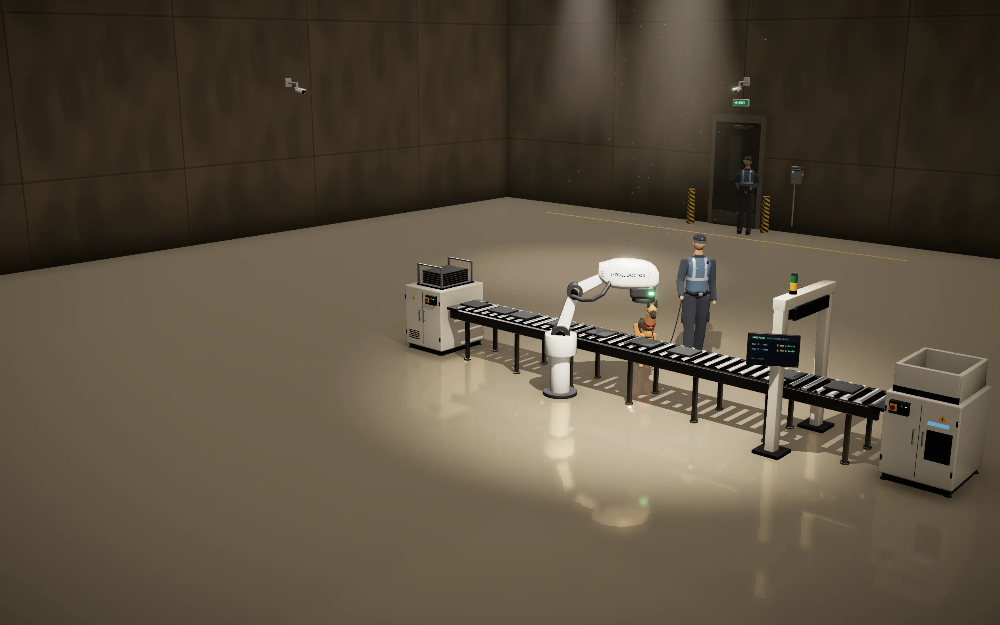
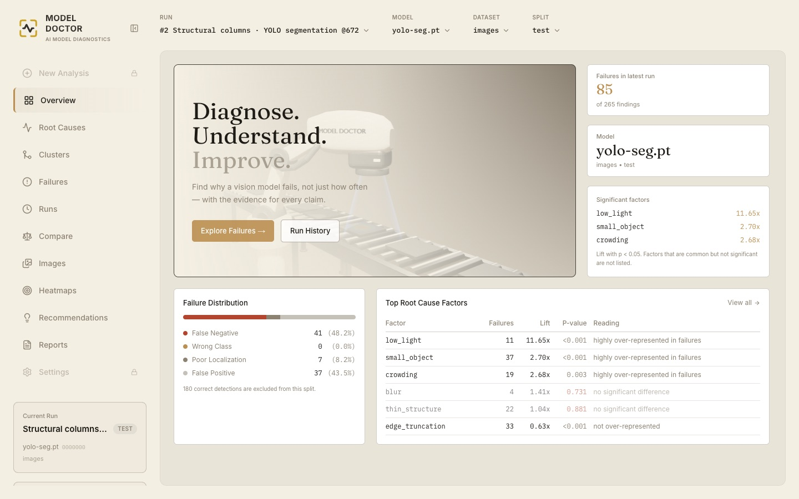
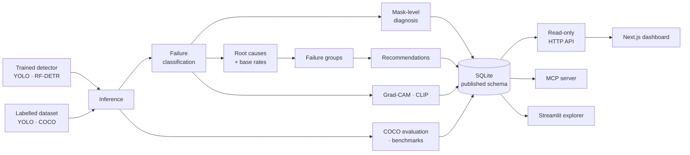

# Model Doctor

### Why your vision model fails — measured, not guessed.

Standard evaluation tells you a detector scored `mAP50 = 0.72`. It cannot tell
you **which** predictions were wrong, **why** they were wrong, or **whether the
pattern is real** enough to act on. Model Doctor answers all three — for every
failure, with the evidence attached.

---

## Why Model Doctor

When a model underperforms, the usual next step is to scroll through
prediction images by hand, form a hunch ("it struggles in the dark?"), and
collect more data on the strength of it. That does not scale, it is not
reproducible, and a hunch is often wrong.

| A metrics report tells you | Model Doctor tells you |
| --- | --- |
| mAP, precision, recall — one number per class | Every failure, classified: **missed**, **spurious**, **poorly localised** or **wrong class** |
| Nothing about images | The exact images and objects behind every number, with heatmaps |
| Nothing about causes | Which conditions are **over-represented in failures** compared with successes — and which suspects are not |
| Nothing about confidence | A significance test for every pattern, and whether it **replicates** on an independent run |
| Nothing about what to do | Recommendations with an evidence status — including "not enough evidence yet" |

---

## Case study — structural column detection

A real analysis, and the one you can explore in the
[live demo](https://model-doctor.vercel.app/dashboard).

**Situation.** A YOLO segmentation model finds structural columns in
construction-site photos. Its aggregate metrics said how well it did overall —
but not which columns it got wrong, or why. Deciding what to change next meant
guessing, or inspecting hundreds of predictions by hand.

**Task.** Find out which predictions fail, what those failures have in common,
and whether each pattern is a genuine cause or noise — *before* spending time
on new data or another training run.

**Action.** Model Doctor ran over the 151-image test split. It classified all
265 findings; measured six conditions on every object (low light, small
object, crowding, blur, thin structure, edge truncation); compared how often
each appears among failures versus correct detections, with a Fisher's exact
test; grouped failures by shared cause; and checked the strongest pattern
against an independent validation run.

**Result.**

- **85 of 265 findings were failures**: 41 missed columns, 37 false
  positives, 7 poorly localised outlines, and no class confusion.
- **Three causes are real.** Low light is **11.65×** over-represented among
  failures (p < 0.001), small objects **2.70×** (p < 0.001), crowding
  **2.68×** (p = 0.003).
- **Two suspects are ruled out.** Blur and thin structure look plausible but
  are not significantly more common in failures (p = 0.73, 0.88) — and objects
  cut off at the frame edge are actually *under*-represented.
- **The small-object pattern replicates** on an independent run
  (3.45×, p = 1.5e-14), so it is safe to act on.

**What that changes:** instead of "collect more data", the next round targets
low-light and small columns specifically — and skips two fixes the evidence
says would not help. Every one of those numbers opens onto the images behind
it.

---

## Use cases

- **Decide what data to collect next.** Spend labelling budget on the
  conditions that actually cause failures, not on the ones that merely seem
  likely.
- **Choose which model to ship.** Compare two runs side by side: failure
  profiles, root causes, mAP from one shared evaluator, and measured latency
  and memory on the same device.
- **Catch problems box metrics hide.** Mask-level diagnosis finds classes that
  are located correctly but outlined badly — two classes with the same box IoU
  can differ sharply in mask IoU.
- **Check a retrain did what you meant.** Re-run on the new model and see
  whether the failure pattern you targeted actually shrank.
- **Explain a model to people who do not read mAP.** Every claim comes with
  the images behind it, grouped into patterns that need no interpreting.
- **Let an AI assistant do the digging.** The MCP server lets Claude or
  another assistant read an analysis and answer "why is this model missing
  objects?" from the stored evidence.

---

## What it does

Every stage reads what the previous one stored, so each claim can be traced
back to the images and annotations that produced it.

| Stage | What it answers |
| --- | --- |
| **Failure classification** | Every prediction and every ground-truth object gets one of five outcomes — correct, wrong class, poorly localised, spurious (false positive), missed (false negative) — per class and per image, with the worst images ranked. |
| **Mask-level diagnosis** | For segmentation models, re-measures each finding by its outline — catching failures a box-level metric cannot see. |
| **Root causes** | Tags each failure with six measurable conditions — low light, small object, crowding, blur, thin structure, edge truncation — and compares their rate among failures with their rate among successes: lift, with a Fisher's exact test. A condition just as common in successes is not a cause. |
| **Replication** | A pattern seen on one run is provisional. Model Doctor checks whether it holds, in the same direction and significantly, on a second independent run — and says so when it does not. |
| **Failure groups** | Groups failures by the causes they share (`edge_truncation`, `blur + crowding`), so you fix a pattern instead of an image. Failures no factor explains form an `unexplained` group rather than disappearing. |
| **Recommendations** | Turns each group into an action — or an explicit refusal. Every recommendation carries its evidence and a status: `replicated`, `provisional`, `conflicting`, or `insufficient_evidence`. |
| **Explanations** | Grad-CAM heatmaps show where the model looked; CLIP embeddings retrieve visually similar failures across the dataset. |
| **Image-level diagnosis** | What went wrong on one image as a whole: coverage, and how its findings relate to one another. |
| **Evaluation and cost** | mAP from one shared COCO evaluator for every detector family — so two models are scored identically — plus measured latency, throughput and memory per device. |
| **Model comparison** | Two runs side by side: which to ship and why, their failure profiles, root-cause lift, mAP and compute cost, and the objects they disagree about drawn over the image. |

### Principles

- **Diagnose, never mutate.** It reads models and datasets; it never trains,
  edits or relabels anything.
- **Evidence over aggregates.** Every number can name the specific images and
  objects behind it.
- **Refuse rather than guess.** A metric the data cannot support is shown as
  *not available* with the reason — never as zero. A pattern two runs disagree
  about gets "do not act yet", not a confident fix.
- **Detector-agnostic.** Analysis runs on a normalised prediction format.
  YOLO is the default family and RF-DETR is fully supported; every stage runs
  unchanged on either (Grad-CAM currently targets YOLO).
- **Read-only by construction.** Every reader opens the database in SQLite's
  read-only mode, so a reader that tried to write would fail at the driver
  rather than silently alter analysis history.

---

## See it live

**[model-doctor.vercel.app](https://model-doctor.vercel.app/)**

- **Dashboard** — the full case study above: failures, heatmaps, root causes,
  failure groups and recommendations, explorable image by image. The public
  copy is read-only; the Analyze tab shows the workflow, locked.
- **Compare** — the same 151 photographs through two detectors, RF-DETR at
  480 px and YOLO at 672 px, decided dimension by dimension: RF-DETR finds
  more columns (recall 85.5% against 78.9%) and copes better with low light,
  while YOLO raises fewer false alarms and handles crowding better.
- **Landing page** — a 3D inspection line built in Blender and rendered in the
  browser with React Three Fiber. Open the **360° view** to orbit the hall,
  drag the scanner arm, click a plate on the belt to scan it, and pull the
  lever by the door to switch the hall lights off.

---

## How it fits together

The **database is the contract.** Its schema is published and versioned
([SCHEMA.md](docs/SCHEMA.md)), and everything downstream reads it rather than
calling into the engine:

- **Web dashboard** (Next.js) — overview, failures, root causes, clusters,
  heatmaps, prediction overlays, model comparison and reports.
- **Read-only HTTP API** (FastAPI) — every endpoint a documented query; files
  addressed by id, never by path.
- **Control service** — the write side: uploads, validation and queued
  analysis jobs, kept in a separate application so the reader's read-only
  guarantee never depends on which handlers are careful.
- **MCP server** — lets an AI assistant read an analysis: runs, findings,
  images, heatmaps, root causes and cross-run comparisons, compactly and
  without write access. Model Doctor is the evidence layer; the assistant is
  the reasoning layer.
- **Python package** — the engine installs on its own, so another system can
  run the analysis inside its own process.

## Built with

| Area | Tools |
| --- | --- |
| Detection | Ultralytics YOLO, RF-DETR, PyTorch |
| Analysis | pycocotools (COCOeval), OpenCLIP, Grad-CAM, NumPy, pandas, scikit-learn; lift and Fisher's exact test implemented in-house |
| Storage | SQLite with a versioned, published schema |
| Services | FastAPI (read-only API and control service), Model Context Protocol server |
| Dashboard | Next.js, React, TypeScript, Tailwind CSS |
| Landing page | React Three Fiber, three.js, postprocessing, Blender (models built by script) |
| Quality | pytest, ruff, TypeScript strict mode, Node's test runner |

## Documentation

The `docs/` folder is written alongside the code, and records the reasoning as
well as the result.

| Document | What it covers |
| --- | --- |
| [VISION.md](docs/VISION.md) | Why the project exists and what it deliberately is not |
| [ARCHITECTURE.md](docs/ARCHITECTURE.md) | How the code is organised |
| [SCHEMA.md](docs/SCHEMA.md) | The published database contract, over SQLite, HTTP and MCP |
| [DECISIONS.md](docs/DECISIONS.md) | Every significant design decision, with the alternatives measured and rejected |
| [ROADMAP.md](docs/ROADMAP.md) | Milestones and their status |
| [CHANGELOG.md](docs/CHANGELOG.md) | What changed, milestone by milestone |
| [PROJECT_CONTEXT.md](docs/PROJECT_CONTEXT.md) | Current state of the project |
| [LANDING_PAGE_DESIGN.md](docs/LANDING_PAGE_DESIGN.md) · [HERO_3D_DESIGN.md](docs/HERO_3D_DESIGN.md) | Design of the landing page and its 3D scene |
