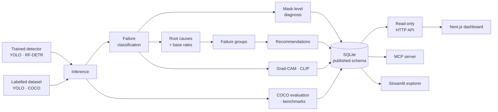

# Model Doctor

**Why a vision model's predictions fail — measured, not guessed.**

**[Live demo → model-doctor.vercel.app](https://model-doctor.vercel.app/)**

Object-detection tooling is very good at telling you *how much* a model fails
and silent about *why*. An evaluation ends with `mAP50 = 0.72`: a real,
comparable number that is almost useless as an instruction. It does not say
which images broke, whether the model is missing objects or inventing them,
whether its boxes are in the right place but too loose, or whether the
failures share a cause such as small objects, blur or objects cut off at the
edge of the frame. So engineers scroll through prediction images by hand —
which does not scale, is not reproducible, and only finds the failures that
happen to be obvious.

Model Doctor makes failure analysis an engineering workflow. Point it at a
trained detector and a labelled dataset, and it answers in a form you can act
on. From the structural-column model in the live demo:

> Failures are concentrated in **small objects** — 3.45× more common among
> failures than among correct detections (496 findings, p = 1.5e-14). The
> pattern **replicates** on a second, independent run: same direction, still
> significant (2.77×, p = 3.4e-06). Every finding behind those numbers can be
> opened, with its image and heatmap.

`mAP50 = 0.72` is a score. That is a diagnosis.

---

## What it does

Every stage reads what the previous one stored, so each claim can be traced
back to the images and annotations that produced it.

| Stage | What it answers |
| --- | --- |
| **Failure classification** | Every prediction and every ground-truth object gets one of five outcomes — correct, wrong class, poorly localised, spurious (false positive), missed (false negative) — per class and per image, with the worst images ranked. |
| **Mask-level diagnosis** | For segmentation models, re-measures each finding by its outline. Two classes can share a box IoU of 0.88 and differ by 0.17 in mask IoU — a failure box-level metrics cannot see. |
| **Root causes** | Tags each failure with six measurable factors — small object, thin structure, edge truncation, blur, crowding, low light — then compares how common each factor is among failures versus correct detections: lift, with a Fisher's exact test. A factor that is just as common in successes is not a cause. |
| **Replication** | A pattern seen on one run is provisional. Model Doctor checks whether it holds, in the same direction and significantly, on a second independent run — and says so when it does not. |
| **Failure groups** | Groups failures by the causes they share (`edge_truncation`, `blur + crowding`), so you fix a pattern instead of an image. Failures no factor explains form an `unexplained` group rather than disappearing. |
| **Recommendations** | Turns each group into an action — or an explicit refusal. Every recommendation carries its evidence and a status: `replicated`, `provisional`, `conflicting`, or `insufficient_evidence`. |
| **Explanations** | Grad-CAM heatmaps show where the model looked; CLIP embeddings retrieve visually similar failures across the dataset. |
| **Image-level diagnosis** | What went wrong on one image as a whole: coverage, and how its findings relate to one another. |
| **Evaluation and cost** | mAP from one shared COCO evaluator for every detector family — so two models are scored identically — plus measured latency, throughput and memory per device. |
| **Model comparison** | Two runs side by side: which to ship and why, their failure profiles, root-cause lift, mAP and compute cost, and the objects they disagree about drawn over the image. |

### Principles

- **Diagnose, never mutate.** It reads models and datasets; it never trains,
  edits or relabels anything.
- **Evidence over aggregates.** Every number can name the specific images and
  objects behind it.
- **Refuse rather than guess.** A metric the data cannot support is shown as
  *not available* with the reason — never as zero. A pattern two runs disagree
  about gets "do not act yet", not a confident fix.
- **Detector-agnostic.** Analysis runs on a normalised prediction format.
  YOLO is the default family and RF-DETR is fully supported; every stage runs
  unchanged on either (Grad-CAM currently targets YOLO).
- **Read-only by construction.** Every reader opens the database in SQLite's
  read-only mode, so a reader that tried to write would fail at the driver
  rather than silently alter analysis history.

---

## The live demo

**[model-doctor.vercel.app](https://model-doctor.vercel.app/)**

- **Landing page** — a 3D inspection line built in Blender and rendered in the
  browser with React Three Fiber. Scroll through the story, or open the
  **360° view** to orbit the hall, drag the scanner arm, click a plate on the
  belt to scan it, hover the verification monitor, and pull the lever by the
  door to switch the hall lights off — the patrolling guard takes out his torch.
- **Dashboard** — one complete, real analysis: a structural-column
  segmentation model (YOLO, 672 px) on its test split. 151 images, 265
  findings with heatmaps, root causes across six factors, 22 failure groups,
  and recommendations. The public copy is read-only: the Analyze tab shows the
  workflow, but running new analyses needs a local installation.

---

## How it fits together

The **database is the contract.** Its schema is published and versioned
([SCHEMA.md](docs/SCHEMA.md), currently version 15), and everything downstream
reads it rather than calling into the engine:

- **Web dashboard** (Next.js) — overview, failures, root causes, clusters,
  heatmaps, prediction overlays, model comparison and reports.
- **Read-only HTTP API** (FastAPI) — every endpoint a documented query; files
  addressed by id, never by path.
- **Control service** — the write side: uploads, validation and queued
  analysis jobs, kept in a separate application so the reader's read-only
  guarantee never depends on which handlers are careful.
- **MCP server** — lets an AI assistant read an analysis: runs, findings,
  images, heatmaps, root causes and cross-run comparisons, compactly and
  without write access. Model Doctor is the evidence layer; the assistant is
  the reasoning layer.
- **Python package** — the engine installs on its own, so another system can
  run the analysis inside its own process.

## Built with

| Area | Tools |
| --- | --- |
| Detection | Ultralytics YOLO, RF-DETR, PyTorch |
| Analysis | pycocotools (COCOeval), OpenCLIP, Grad-CAM, NumPy, pandas, scikit-learn; lift and Fisher's exact test implemented in-house |
| Storage | SQLite with a versioned, published schema |
| Services | FastAPI (read-only API and control service), Model Context Protocol server |
| Dashboard | Next.js, React, TypeScript, Tailwind CSS |
| Landing page | React Three Fiber, three.js, postprocessing, Blender (models built by script) |
| Quality | pytest, ruff, TypeScript strict mode, Node's test runner |

## Documentation

The `docs/` folder is written alongside the code, and records the reasoning as
well as the result.

| Document | What it covers |
| --- | --- |
| [VISION.md](docs/VISION.md) | Why the project exists and what it deliberately is not |
| [ARCHITECTURE.md](docs/ARCHITECTURE.md) | How the code is organised |
| [SCHEMA.md](docs/SCHEMA.md) | The published database contract, over SQLite, HTTP and MCP |
| [DECISIONS.md](docs/DECISIONS.md) | Every significant design decision, with the alternatives measured and rejected |
| [ROADMAP.md](docs/ROADMAP.md) | Milestones and their status |
| [CHANGELOG.md](docs/CHANGELOG.md) | What changed, milestone by milestone |
| [PROJECT_CONTEXT.md](docs/PROJECT_CONTEXT.md) | Current state of the project |
| [LANDING_PAGE_DESIGN.md](docs/LANDING_PAGE_DESIGN.md) · [HERO_3D_DESIGN.md](docs/HERO_3D_DESIGN.md) | Design of the landing page and its 3D scene |
